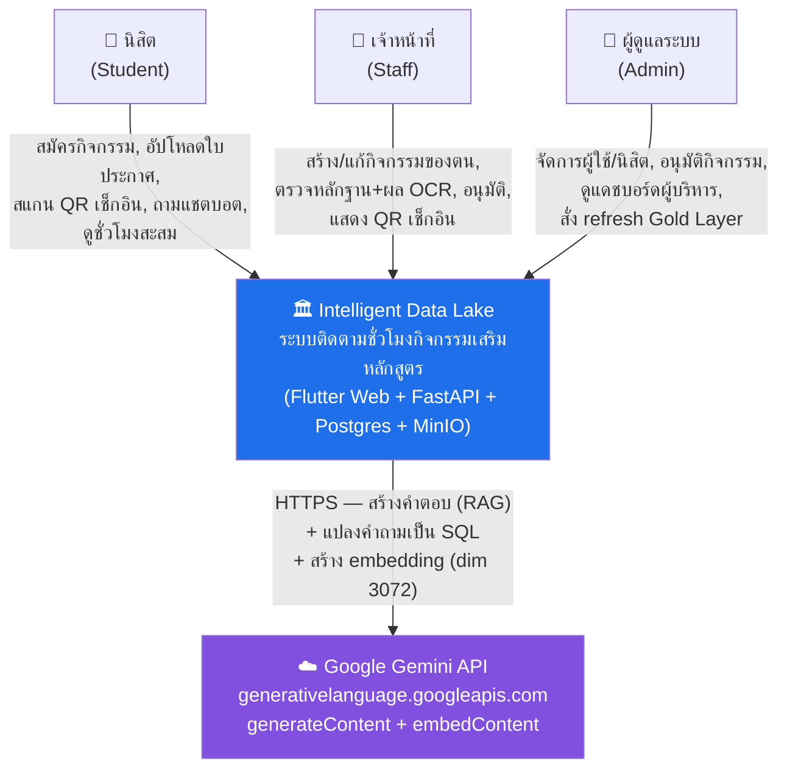
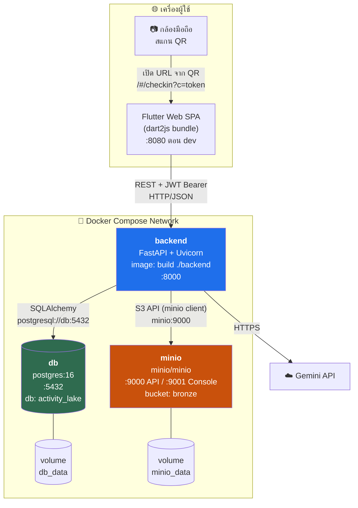
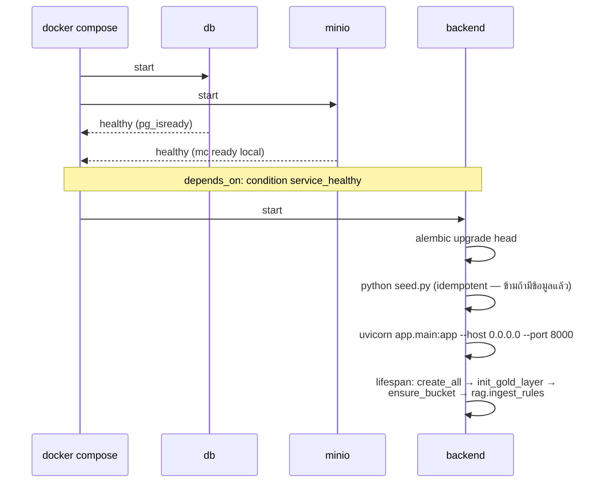
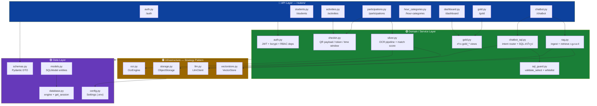
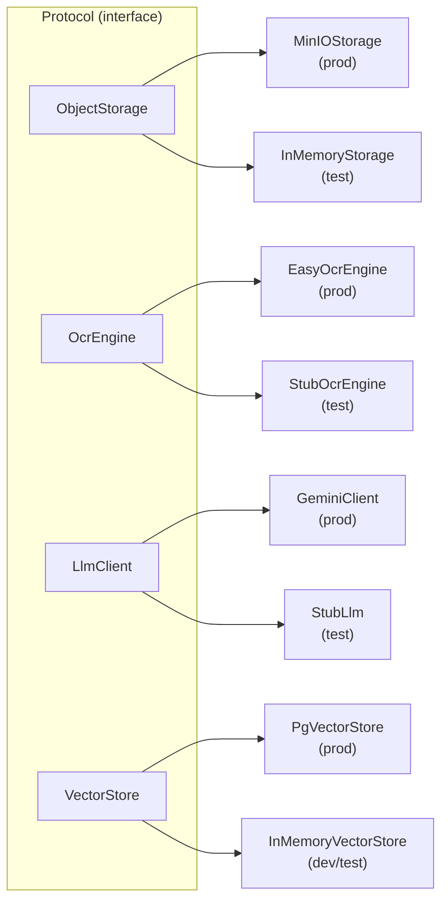
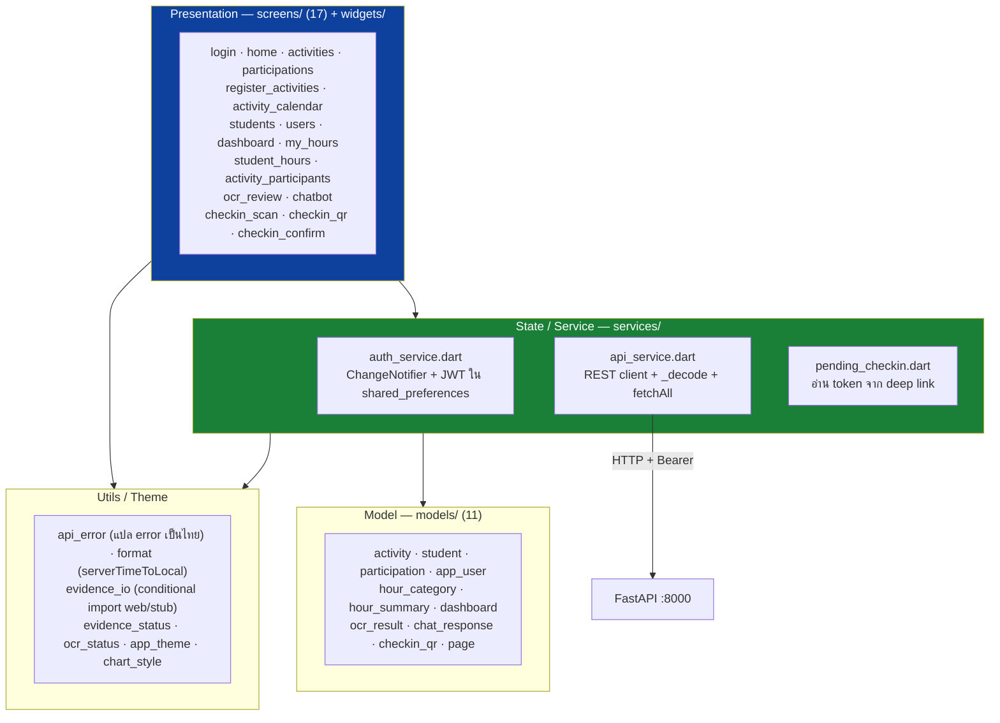
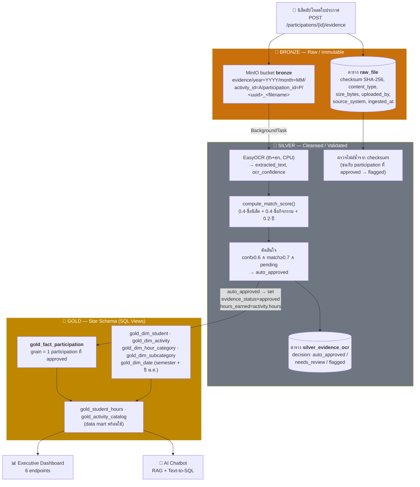
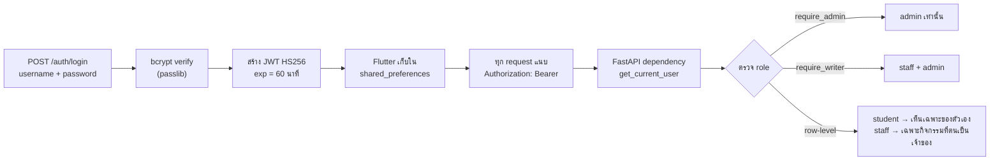
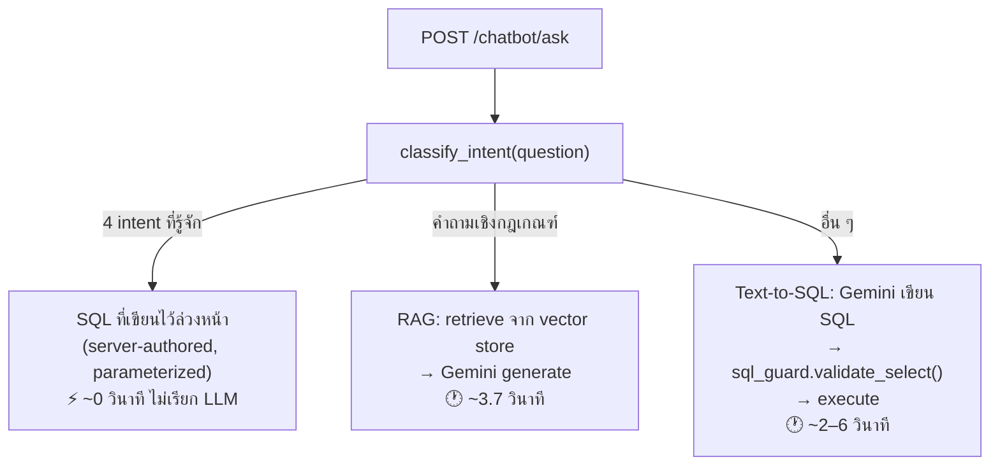

# สเปกสถาปัตยกรรมระบบ (Architecture Specification)

> **Intelligent Data Lake for Student Activity Participation Tracking**
> ระบบติดตามการเข้าร่วมกิจกรรมเสริมหลักสูตรของนิสิต มหาวิทยาลัยทักษิณ
>
> เอกสารนี้เป็น **คู่มือสำหรับวาดไดอะแกรมสถาปัตยกรรม** (System Context / Container / Component / Deployment / Data Flow / Layered)
> เป็นเอกสารคู่กับ `SYSTEM_SPEC_for_Diagrams.md` (ซึ่งครอบคลุม Use Case / ER / Class / Sequence)
>
> ข้อมูลทุกส่วนสกัดจากซอร์สโค้ดจริง ณ 2026-08-02 (`backend/app`, `frontend/lib`, `docker-compose.yml`, `backend/alembic`) ไม่ใช่การคาดเดา

---

## สารบัญ

| # | หัวข้อ | ใช้วาดไดอะแกรมอะไร |
|---|---|---|
| 1 | System Context | C4 Level 1 — ระบบกับโลกภายนอก |
| 2 | Container / Deployment | C4 Level 2 — โครงสร้างตอน deploy |
| 3 | Component (Backend) | C4 Level 3 — โมดูลภายใน backend |
| 4 | Component (Frontend) | โครงสร้างฝั่ง Flutter |
| 5 | Layered Architecture | ภาพตัดขวางเป็นชั้น |
| 6 | Data Architecture (Medallion) | Data Flow Diagram |
| 7 | Cross-Cutting Concerns | ประกอบทุกไดอะแกรม |
| 8 | Runtime Views | ลำดับการทำงานสำคัญ |
| 9 | Environment Matrix | Deployment Diagram หลายสภาพแวดล้อม |
| 10 | Architecture Decisions | เหตุผลเบื้องหลัง (ADR) |
| 11 | Constraints & Risks | ข้อจำกัดที่ต้องระบุในรายงาน |

---

# 1. System Context (C4 Level 1)

ระบบมองจากภายนอก: ใครใช้ และคุยกับระบบภายนอกอะไรบ้าง



### Actor และขอบเขต

| Actor | Role ในระบบ | ผูกกับตาราง `student` | จำนวนใน seed |
|---|---|---|---|
| นิสิต | `student` | ✅ ต้องมี `user.student_id` | 100 |
| เจ้าหน้าที่ | `staff` | ❌ | 1 (`staff`) |
| ผู้ดูแลระบบ | `admin` | ❌ | 2 (`admin`, `พี`) |

### ระบบภายนอกเดียวที่มี

**Google Gemini API** — เรียกจาก backend เท่านั้น (frontend ไม่เคยถือ API key)
- โมเดลข้อความ: `gemini-flash-latest`
- โมเดล embedding: `models/gemini-embedding-001` (dimension 3072)
- **สลับเป็น `StubLlm` แบบออฟไลน์ได้** ผ่าน `LLM_BACKEND=stub` → ระบบทำงานได้ครบโดยไม่ต้องต่อเน็ต (ค่าเริ่มต้นของโค้ดคือ stub)

> **จุดที่ควรระบุในรายงาน:** ระบบไม่ได้เชื่อมกับฐานข้อมูลทะเบียนกลางของมหาวิทยาลัย ข้อมูลนิสิตมาจาก seed/การกรอกโดย admin

---

# 2. Container / Deployment View (C4 Level 2)

โครงสร้างตอนรันจริงด้วย `docker compose up -d --build`



### ตาราง Container

| Container | Image | Port (host→container) | Volume | Healthcheck |
|---|---|---|---|---|
| `db` | `postgres:16` | 5432→5432 | `db_data:/var/lib/postgresql/data` | `pg_isready -U postgres` (5s/5s/10) |
| `minio` | `minio/minio` | 9000→9000, 9001→9001 | `minio_data:/data` | `mc ready local` (5s/5s/10) |
| `backend` | build `./backend` | 8000→8000 | — (ไม่มี mount โค้ด) | — |

### ลำดับการบูต (สำคัญมาก — ต้องอยู่ใน Deployment Diagram)



**Command จริงของ backend:**
```
sh -c "alembic upgrade head && python seed.py && uvicorn app.main:app --host 0.0.0.0 --port 8000"
```

> ⚠️ **ข้อควรระวังที่ต้องเน้น:** `backend` **ไม่มี volume mount โค้ด** — แก้โค้ดแล้วต้อง `docker compose up -d --build backend` เสมอ ไม่งั้นยังรัน image เก่า

---

# 3. Component View — Backend (C4 Level 3)



### หน้าที่ของแต่ละโมดูล

| โมดูล | หน้าที่ | หมายเหตุสถาปัตยกรรม |
|---|---|---|
| `main.py` | ประกอบแอป, CORS middleware, `/health`, include 8 routers, lifespan | lifespan ทำ 4 อย่าง — **3 อย่างหลังเป็น best-effort** (try/except + log) เพื่อให้ API บูตได้แม้ MinIO/LLM ล่ม |
| `config.py` | `Settings(BaseSettings)` อ่าน `.env` | Single source of truth ของ config ทั้งระบบ |
| `database.py` | สร้าง `engine`, `get_session()` dependency | `connect_args` แตกต่างตาม dialect (SQLite ต้อง `check_same_thread=False`) |
| `models.py` | Entity 8 ตัว + Enum | SQLModel = SQLAlchemy table + Pydantic ในคลาสเดียว |
| `schemas.py` | DTO (`*Create/*Read/*Update`), `Page[T]` | ใช้ `extra="forbid"` กันการยัดฟิลด์ต้องห้าม |
| `auth.py` | `hash_password`, JWT, `get_current_user`, `require_admin`, `require_writer` | RBAC ทำผ่าน FastAPI dependency ระดับ router/endpoint |
| `storage.py` | Bronze object storage | Protocol + `MinIOStorage` / `InMemoryStorage`, **lazy import** `minio` |
| `ocr.py` | อ่านข้อความจากภาพ | Protocol + `EasyOcrEngine` / `StubOcrEngine`, **lazy import** `easyocr` |
| `silver.py` | ไปป์ไลน์ Silver: OCR → ตรวจซ้ำ → match score → ตัดสิน | รันแบบ BackgroundTask ด้วย `Session(engine)` ของตัวเอง |
| `gold.py` | สร้าง/รีเฟรช `gold_*` SQL views | **dialect-branched** date expression (strftime ↔ to_char/extract) |
| `llm.py` | เรียก LLM | Protocol + `GeminiClient` / `StubLlm`, **lazy import** `google.generativeai` |
| `vectorstore.py` | เก็บ/ค้น embedding | Protocol + `InMemoryVectorStore` / `PgVectorStore` |
| `rag.py` | เอกสารกฎ (inline text) → chunk → embed → retrieve | เอกสารเกณฑ์ฝังเป็น `RULES_DOCUMENT` ในโค้ด ไม่ได้ parse PDF |
| `chatbot_sql.py` | จำแนก intent + SQL ที่เขียนไว้ล่วงหน้า + text-to-SQL | 4 intent หลักไม่เรียก LLM เลย (ตอบ ~0 วินาที) |
| `sql_guard.py` | `validate_select()` — SELECT-only + table whitelist | ด่านความปลอดภัยของเส้นทาง text-to-SQL |
| `checkin.py` | `qr_payload()`, `normalize_token()`, `checkin_window()` | `normalize_token` รับ 3 รูปแบบ: URL / `TSU-CHECKIN:` / token เปล่า |

### Strategy Pattern — จุดเด่นทางสถาปัตยกรรม (ควรมีสไลด์แยก)

ทั้ง 4 ชุดใช้รูปแบบเดียวกัน: `Protocol` → 2 implementation → factory `get_*()` อ่านจาก config



| Protocol | env var | prod | dev/test |
|---|---|---|---|
| `ObjectStorage` | `STORAGE_BACKEND` | `minio` | `memory` |
| `OcrEngine` | `OCR_BACKEND` | `easyocr` | `stub` |
| `LlmClient` | `LLM_BACKEND` | `gemini` | `stub` |
| `VectorStore` | `VECTOR_BACKEND` | `pgvector` | `memory` |

**ประโยชน์ที่ได้จริง:** dependency หนัก (`minio`, `easyocr`+torch, `google-generativeai`) **ไม่ได้ติดตั้งใน `.venv`** แต่เทสต์ 264 ข้อยังผ่าน เพราะทุก implementation ใช้ *lazy import* ภายในเมท็อด ไม่ใช่ระดับโมดูล

---

# 4. Component View — Frontend (Flutter Web)



### รูปแบบสถาปัตยกรรมฝั่ง client

| ประเด็น | วิธีที่ใช้ |
|---|---|
| State management | `ChangeNotifier` + `ListenableBuilder` (ไม่ใช้ Provider/Riverpod/BLoC) |
| Routing | `ListenableBuilder(Listenable.merge([authService, pendingCheckin]))` เลือกหน้าจาก state — **ไม่ใช้ named route table** |
| URL strategy | **hash routing** (ไม่เรียก `usePathUrlStrategy()`) → deep link เป็น `/#/checkin?c=<token>` |
| เก็บ token | `shared_preferences` (คงอยู่ข้ามการรีเฟรช) |
| จัดการ error | รวมศูนย์ที่ `ApiService._decode` → `api_error.dart` แปลเป็นข้อความไทย |
| Platform-specific | conditional import (`evidence_io_web.dart` / `evidence_io_stub.dart`) ให้ `flutter test` บน VM คอมไพล์ผ่าน |
| แยก widget เพื่อเทสต์ | `checkin_qr_view.dart`, `hour_summary_view`, `checkin_result.dart` แยกจาก screen ที่โหลดข้อมูล |

---

# 5. Layered Architecture (ภาพตัดขวาง)

```
┌───────────────────────────────────────────────────────────────┐
│ L1  PRESENTATION       Flutter Web SPA — 17 screens, Material 3│
│                        ภาษาไทยทั้งหมด, responsive              │
└───────────────────────────────┬───────────────────────────────┘
                    REST/JSON + JWT Bearer (CORS)
┌───────────────────────────────▼───────────────────────────────┐
│ L2  API / CONTROLLER   FastAPI 8 routers, ~40 endpoints        │
│                        Pydantic validation, RBAC dependency    │
└───────────────────────────────┬───────────────────────────────┘
┌───────────────────────────────▼───────────────────────────────┐
│ L3  DOMAIN / SERVICE   silver · gold · checkin · rag           │
│                        chatbot_sql · sql_guard · auth          │
│                        ← กฎธุรกิจทั้งหมดอยู่ชั้นนี้              │
└───────────────────────────────┬───────────────────────────────┘
┌───────────────────────────────▼───────────────────────────────┐
│ L4  INFRASTRUCTURE     storage · ocr · llm · vectorstore       │
│                        (Protocol + สลับ implementation ได้)     │
└───────────────────────────────┬───────────────────────────────┘
┌───────────────────────────────▼───────────────────────────────┐
│ L5  PERSISTENCE        PostgreSQL 16 (OLTP + gold views)       │
│                        MinIO (Bronze objects)                  │
│                        Alembic migrations                      │
└───────────────────────────────────────────────────────────────┘
```

**กฎการพึ่งพา (Dependency Rule):** ลูกศรชี้ลงเท่านั้น — ชั้นล่างไม่รู้จักชั้นบน
**ข้อยกเว้นที่ยอมรับไว้:** `silver.process_evidence_in_background` ถูกเรียกจาก L2 (router) แต่เปิด `Session` ของตัวเอง เพราะรันหลัง response ส่งกลับไปแล้ว

---

# 6. Data Architecture — Medallion (Bronze → Silver → Gold)

**หัวใจของโปรเจกต์** — ควรเป็นไดอะแกรมหลักในรายงาน



### ตารางสรุปชั้นข้อมูล

| ชั้น | เก็บที่ไหน | ลักษณะ | ใครอ่าน |
|---|---|---|---|
| **Bronze** | MinIO object + ตาราง `raw_file` | Immutable — อัปโหลดใหม่ = object ใหม่เสมอ ไม่ทับของเดิม | Silver pipeline, endpoint ดูหลักฐาน (stream ผ่าน backend, bucket ไม่เปิด public) |
| **Silver** | ตาราง `silver_evidence_ocr` | ผลตรวจสอบ + คะแนนความมั่นใจ + คำตัดสิน | หน้า OCR review ของเจ้าหน้าที่ |
| **Gold** | SQL **Views** ขึ้นต้น `gold_` | Star schema, อ่านอย่างเดียว, สร้างใหม่ตอน startup | Dashboard, Chatbot — **ห้ามแตะตาราง operational ตรง ๆ** |

### ตัวเลขจริงในฐานข้อมูล Postgres (ณ 2026-08-02)

| ตาราง | จำนวน |
|---|---|
| `student` | 100 |
| `user` | 103 |
| `activity` | 29 |
| `participation` | 1,160 |
| `raw_file` (Bronze) | 1,129 |
| `silver_evidence_ocr` | 1,130 → `needs_review` 1,100 / `auto_approved` 30 |
| gold views | 8 |

> **จุดที่ต้องอธิบายในรายงาน:** `gold_` เป็น **prefix ของ view ไม่ใช่ schema** ของ Postgres — เลือกแบบนี้เพื่อให้ DDL ชุดเดียวพอร์ตข้ามได้ทั้ง SQLite (dev/test) และ PostgreSQL (prod) โดยแตกกิ่งเฉพาะนิพจน์วันที่ (`strftime` ↔ `to_char`/`extract`)

---

# 7. Cross-Cutting Concerns

### 7.1 Security / Authentication



| กลไก | รายละเอียด |
|---|---|
| Password | bcrypt ผ่าน passlib — ไม่เคยเก็บ plaintext |
| Token | JWT HS256, `ACCESS_TOKEN_EXPIRE_MINUTES=60` |
| RBAC ระดับ router | `dependencies=[Depends(require_admin)]` ทั้ง router (เช่น `/dashboard` → non-admin 403 ทุก endpoint) |
| Row-level | บังคับในโค้ด service: นิสิตเห็นเฉพาะ `student_id` ตัวเอง, staff เห็นเฉพาะกิจกรรมที่ `created_by` = ตน |
| Mass assignment | `extra="forbid"` ใน DTO กัน `hours_earned` / `student_id` ที่ยัดมาจาก client |
| SQL Injection (chatbot) | `sql_guard.validate_select()` — SELECT อย่างเดียว + whitelist ตาราง (`TTS_ALLOWED_TABLES`) |
| Object storage | bucket **ไม่ public** — ไฟล์ทุกไฟล์ stream ผ่าน backend ที่ตรวจสิทธิ์ก่อน |
| ป้องกัน QR ปลอม/ย้อนหลัง | หน้าต่างเวลาเช็กอิน: `start_at − 60 นาที` ถึง `start_at + activity.hours + 180 นาที` |

### 7.2 Configuration

`.env` (root) → `app/config.py` `Settings` → ฉีดเข้าทุกโมดูล
ตอนรันใน docker compose **override ด้วย environment ของ service** (`DATABASE_URL` → `db:5432`, `MINIO_ENDPOINT` → `minio:9000`)

### 7.3 Database Migration

| ลำดับ | Revision | เนื้อหา |
|---|---|---|
| 1 | `9edffc436b9a` | initial schema |
| 2 | `a772953965c8` | drop `activity.hour_category` |
| 3 | `b1c2d3e4f5a6` | เพิ่ม `raw_file` (Bronze) |
| 4 | `c2d3e4f5a6b7` | เพิ่ม `activity.hours` |
| 5 | `d3e4f5a6b7c8` | เพิ่ม `silver_evidence_ocr` |
| 6 | `e4f5a6b7c8d9` | constraint `max_participants > 0` |
| 7 | `f5a6b7c8d9e0` | **head** — เพิ่ม `activity.checkin_token` (QR) |

Alembic อ่าน URL จาก `settings.database_url` เดียวกับแอป (ไม่ต้องแก้ `alembic.ini`)

### 7.4 Asynchronous Processing

จุดเดียวในระบบที่ทำงานแบบ async: **Silver OCR pipeline**
`POST /participations/{id}/evidence` → ตอบ 201 ทันที → FastAPI `BackgroundTasks` เรียก `silver.process_evidence_in_background(pid)` ซึ่งเปิด `Session(engine)` ของตัวเอง (best-effort, ล้มแล้วไม่กระทบ response)

---

# 8. Runtime Views (สถานการณ์สำคัญ)

> Sequence diagram แบบละเอียด 8 ชุดอยู่ใน `SYSTEM_SPEC_for_Diagrams.md` §4 — ตรงนี้สรุปเฉพาะเส้นทางที่มีนัยทางสถาปัตยกรรม

### 8.1 อัปโหลดหลักฐาน → Bronze → Silver (เส้นทางสำคัญที่สุด)

```
Flutter → POST /participations/{id}/evidence (multipart)
        → ตรวจสิทธิ์ (เจ้าของ/admin) + ชนิดไฟล์ (jpeg/png/pdf) + ขนาด (≤10MB)
        → คำนวณ SHA-256 → upload MinIO (object ใหม่เสมอ) → insert raw_file
        → reset evidence_status = pending
        → 201 Created ─────────────────► (ผู้ใช้ได้รับคำตอบแล้ว)
                    ↓ BackgroundTask
        → OCR → ตรวจซ้ำ → match_score → decision → insert silver_evidence_ocr
        → ถ้า auto_approved: evidence_status=approved, hours_earned=activity.hours
```

### 8.2 เช็กอินหน้างานด้วย QR (deep link)

```
เจ้าหน้าที่: GET /activities/{id}/checkin-qr  (staff เจ้าของ/admin เท่านั้น)
            → qr_payload = {PUBLIC_APP_BASE_URL}/#/checkin?c=<token>
นิสิต:      กล้องมือถือสแกน → เปิดเบราว์เซอร์ → Flutter อ่าน token
            (PendingCheckin อ่านจากทั้ง defaultRouteName และ Uri.base)
            → ถ้ายังไม่ล็อกอิน: เก็บ token ไว้เป็น state → หลังล็อกอินพาไปต่อ
            → หน้ายืนยัน → POST /participations/checkin {token}
            → ตรวจ token → approved → ช่วงเวลา → ซ้ำ/walk-up
            → บันทึก check_in_time (hours_earned ยัง 0, evidence ยัง pending)
```

### 8.3 Chatbot — 3 เส้นทาง (แยกความเร็วชัดเจน)



---

# 9. Environment Matrix

| ประเด็น | **dev (local)** | **docker compose (prod-like)** | **test (pytest)** |
|---|---|---|---|
| Database | SQLite `backend/dev.db` *(ทางเลือก)* | **PostgreSQL 16** `activity_lake` | SQLite in-memory (`sqlite://`, StaticPool) |
| `DATABASE_URL` | `postgresql://…@localhost:5432/…` (ค่าปัจจุบัน) | `postgresql://…@db:5432/…` | ตั้งใน `conftest.py` ไม่อ่าน `.env` |
| Object Storage | MinIO @ `localhost:9000` | MinIO @ `minio:9000` | `InMemoryStorage` |
| OCR | `easyocr` (ถ้าติดตั้ง) | `easyocr` (preload ใน image) | `FakeOcr` / `StubOcrEngine` |
| LLM | `gemini` (มี key ใน `.env`) | `gemini` (ส่งผ่าน `${}` จาก root `.env`) | `StubLlm` |
| Vector Store | `memory` | `memory` (ภาพ `postgres:16` ไม่มี pgvector) | `memory` |
| Migration | รันมือ | อัตโนมัติตอนบูต | `create_all` เท่านั้น |
| จำนวนเทสต์ | — | — | **264 backend passed + 1 skipped, 109 flutter** |

> ⚠️ **ข้อมูลสองฐานไม่ตรงกัน:** `dev.db` มี `silver_evidence_ocr` = **0 แถว** ส่วน Postgres มี **1,130 แถว** (งาน OCR seed ทำบน docker ล้วน ๆ) — ถ้าเจออาการ "ไม่มีผล OCR เลย" ให้เช็ก `DATABASE_URL` ก่อนดีบักโค้ด

---

# 10. Architecture Decisions (ADR)

| # | การตัดสินใจ | เหตุผล | ข้อแลกเปลี่ยน |
|---|---|---|---|
| 1 | Gold Layer เป็น **SQL Views** ไม่ใช่ตารางที่ materialize | DDL ชุดเดียวใช้ได้ทั้ง SQLite และ Postgres; ข้อมูลสดเสมอไม่ต้องรัน ETL | คิวรีหนักขึ้นเมื่อข้อมูลโต — ยังไม่เป็นปัญหาที่ 1,160 แถว |
| 2 | ใช้ prefix `gold_` แทน Postgres schema แยก | พอร์ตข้าม dialect ได้ | ไม่ได้ประโยชน์เรื่องสิทธิ์ระดับ schema |
| 3 | **Strategy Pattern + lazy import** ทั้ง 4 infrastructure | เทสต์รันได้โดยไม่ต้องติดตั้ง torch/minio/gemini | ต้องระวังไม่ import ที่ระดับโมดูล |
| 4 | OCR รันแบบ **BackgroundTask** ไม่ใช่ message queue | ลดชิ้นส่วนที่ต้องดูแล (ไม่ต้องมี Celery/Redis) | ถ้า process ตาย งานหาย ไม่มี retry |
| 5 | ชั่วโมงมาจาก `activity.hours` เท่านั้น (กฎ A2) | กันการยัดชั่วโมงจาก client และทำให้ตัวเลขตรวจสอบย้อนกลับได้ | เปลี่ยนชั่วโมงกิจกรรมกระทบทุกคนที่เข้าร่วม |
| 6 | อนุมัติได้ต่อเมื่อมีหลักฐาน Bronze จริง (กฎ A3) | ทุกชั่วโมงมี lineage กลับไปถึงไฟล์ต้นทาง | เพิ่มขั้นตอนให้ผู้ใช้ |
| 7 | QR เก็บ **URL เต็ม** ไม่ใช่ token เปล่า | กล้องมือถือทั่วไปขึ้นปุ่ม "เปิดลิงก์" ให้เลย ไม่ต้องมีแอปสแกน | ผูกกับ `PUBLIC_APP_BASE_URL` ต้องตั้งให้ถูกตอน deploy |
| 8 | ใช้ **hash routing** (`/#/checkin?c=`) | ไม่ต้องตั้ง server-side rewrite สำหรับ SPA | URL ไม่สวย; `normalize_token` ต้องอ่าน `c=` จากทั้ง query และ fragment |
| 9 | 4 intent ของ chatbot ใช้ **SQL ที่ server เขียนเอง** | ตอบเร็ว ~0 วินาที, ถูกต้องแน่นอน, ไม่เสียค่า API | ครอบคลุมเฉพาะคำถามที่คาดไว้ |
| 10 | Text-to-SQL ผ่าน `sql_guard` whitelist | กัน LLM สร้าง SQL ที่ทำลายข้อมูล | คำถามที่ต้องใช้ตารางนอก whitelist ตอบไม่ได้ |
| 11 | `LLM_BACKEND` ค่าเริ่มต้น = `stub` | แอปบูตและเทสต์ผ่านโดยไม่ต้องมี API key | ต้องตั้ง `.env` ให้ถูกถึงจะได้ AI จริง |

---

# 11. Constraints & Known Risks

| ประเด็น | รายละเอียด | ผลกระทบ |
|---|---|---|
| กล้องบนเว็บ | ทำงานเฉพาะ **HTTPS หรือ localhost** — เปิดผ่าน IP ใน LAN กล้องไม่ติด | ต้องมี HTTPS ตอน deploy จริง |
| `VECTOR_BACKEND=memory` | ดัชนี RAG อยู่ใน memory ของ **process uvicorn** | ถ้ารัน multi-worker ต้องเปลี่ยนเป็น pgvector |
| ภาพ `postgres:16` | **ไม่มี extension pgvector** | ถ้าจะใช้ pgvector ต้องเปลี่ยนเป็น `pgvector/pgvector:pg16` |
| ไม่มี `activity.end_at` | ใช้ `activity.hours` แทนความยาวกิจกรรมในการคำนวณหน้าต่างเช็กอิน | ควรทบทวนกับอาจารย์ |
| backend ไม่มี volume mount | แก้โค้ดแล้วต้อง `--build` เสมอ | หลงคิดว่าโค้ดไม่ทำงาน |
| Alembic บน volume เก่า | Postgres volume ที่สร้างด้วย `create_all` มาก่อนจะชนกับ `upgrade head` | ต้อง `alembic stamp` หรือใช้ volume ใหม่ |
| Migration + gold views | ต้อง DROP `gold_*` views ก่อน `batch_alter_table` บน SQLite | migration ล้มกลางคัน |
| กฎการนับชั่วโมง | ยังไม่สรุปว่าใช้ขั้นต่ำราย subcategory หรือยอดรวมรายหมวด (ปัจจุบันใช้ยอดรวม) | **open item รอยืนยันกับอาจารย์** |

---

# 12. Quality Attributes (คุณลักษณะเชิงคุณภาพ)

| คุณลักษณะ | ทำอย่างไร | หลักฐาน |
|---|---|---|
| **Testability** | Protocol + dependency override + lazy import | 264 backend + 109 flutter tests, ไม่ต้องมี MinIO/GPU/API key |
| **Portability** | DDL แตกกิ่งตาม dialect, config ผ่าน env | รันได้ทั้ง SQLite และ Postgres ด้วยโค้ดชุดเดียว |
| **Availability** | lifespan ทำ 3 งานหลังแบบ best-effort | MinIO/Gemini ล่ม API ยังบูตและให้บริการส่วนอื่นได้ |
| **Traceability** | ทุกชั่วโมงย้อนกลับถึงไฟล์ Bronze ได้ (กฎ A3) | `participation → raw_file → MinIO object` |
| **Security** | RBAC 3 ชั้น + `extra="forbid"` + SQL whitelist + bucket ไม่ public | ดู §7.1 |
| **Maintainability** | แยกชั้นชัดเจน, Alembic คุม schema | 7 migrations ต่อเนื่อง |

---

## ภาคผนวก — Prompt สำหรับให้ Claude วาดต่อ

> ใช้เอกสารนี้ (`ARCHITECTURE_SPEC_for_Diagrams.md`) เป็นข้อมูลตั้งต้น แล้วสั่งงานเช่น:
>
> - "วาด System Context Diagram (C4 Level 1) จาก §1 เป็น SVG"
> - "วาด Container Diagram (C4 Level 2) จาก §2 พร้อมระบุ port และ volume"
> - "วาด Component Diagram ของ backend จาก §3 โดยแยกสีตามชั้น"
> - "วาด Data Flow Diagram ของ Medallion จาก §6"
> - "วาด Deployment Diagram เปรียบเทียบ dev / docker / test จาก §9"
> - "สรุป §10 เป็นสไลด์ ADR หัวข้อละ 1 หน้า"
